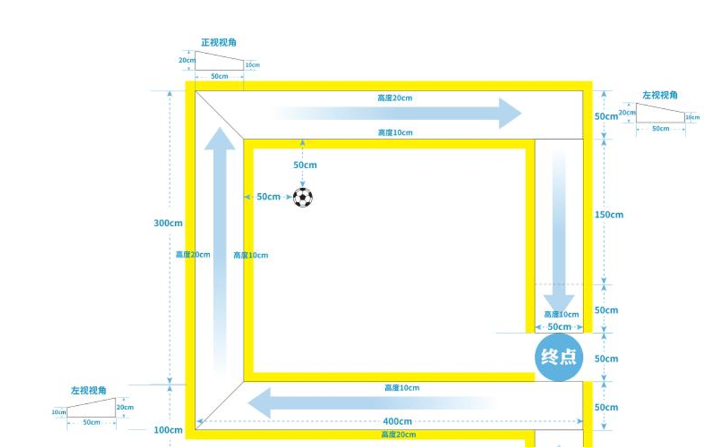
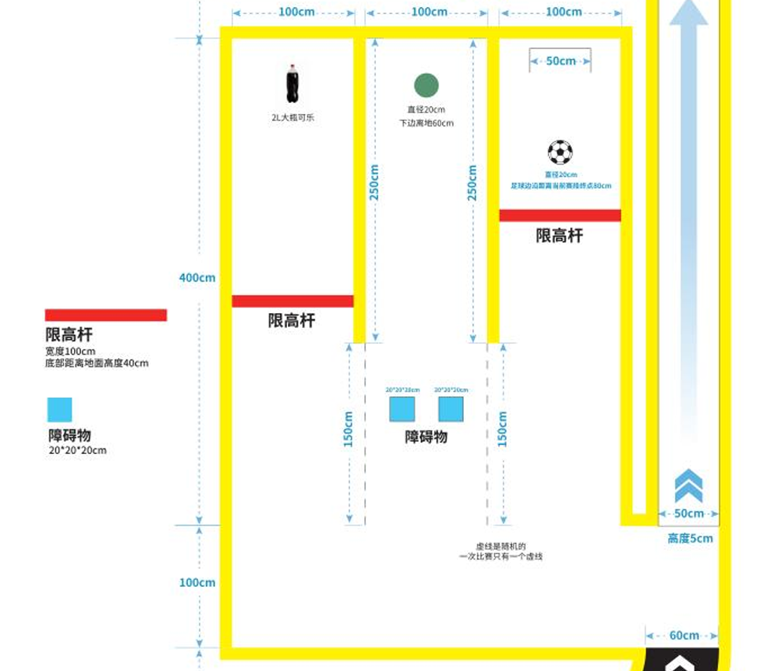
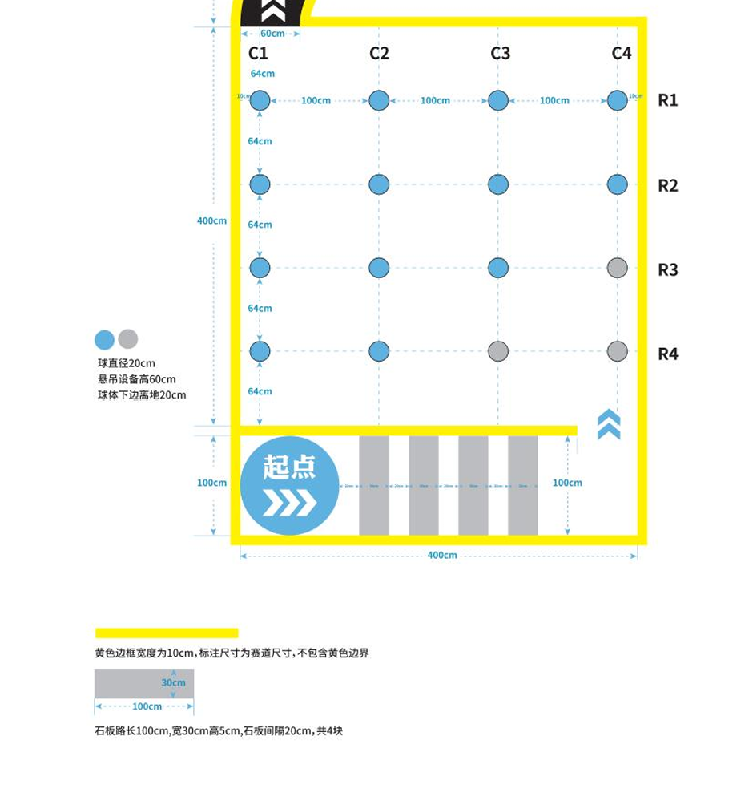

四、任务规则
1. 石径探路：
   - 赛段要求：机器狗摆放在起点位置，头朝箭头方向，处于趴下状态；
   - 开始比赛：机器狗站起，开始计时；
   - 赛段结束：后腿足底离开弯道虚线后；
   - 本赛段不允许跳过。
2. 荒野寻珠：
   - 赛段要求：寻找并撞击橙色小球，可以使用身体任何部位来撞击，需要有明显晃动；
   - 赛前调整：入口处3个小球固定使用浅蓝色(图中灰色表示：R4C4，R4C3，R3C4)，其余小球会在赛前调整，规则为每行每列都有1个橙色小球；
   - 赛段结束：后腿足底离开出口虚线后。
3. 曲道冲锋：
   - 赛段要求：全程在赛道内行进，不得踩线或者越线；
   - 赛段结束：后腿足底离开弯道虚线后。
4. 深隧寻珍：
   - 赛段要求：通过横向通道在三个竖向通道中寻找目标物体，过程中要避开障碍物。
     - 目标物体：
       - 大桶可乐，识别后语音播报：“识别到可乐瓶”，击倒可乐瓶（可以使用身体任何部位）；
       - 橙色球，识别后语音播报：“识别到橙色小球”，使小球明显晃动（不允许使用后空翻相关动作）；
       - 足球，识别后语音播报：“识别到足球”，将小球踢入门内（可以连续撞击，可以使用身体任何部位）。
     - 障碍物：
       - 限高杆，识别后语音播报：“识别到限高杆”；
       - 无法跨越障碍物，识别后语音播报：“识别到无法跨越障碍”。
     - 避障行为：
       - 需要从限高杆下通过，全程不允许碰撞限高杆；
       - 需要绕过无法跨越障碍物，不允许碰撞，可以穿过虚线借道后再返回。
   - 赛前准备：3个目标物体在竖向通道内均会做随机调整, 3个障碍物在竖向通道中1米范围内随意移动；
   - 赛段结束：前腿足底碰到独木桥起始端，当前赛段结束。
5. 孤梁稳渡：
   - 赛段要求：通过连续独木桥，穿过独木桥上的虚线后可以跳下；
     - 必须是四个足底都越过虚线后才可以跳下；
     - 跳下时，不允许身体撞击独木桥。
   - 赛段结束：设备成功跳下，当前赛段结束。
6. 撷金建功：
   - 赛段要求：将足球从出口位置踢出，设备摔倒或者碰撞独木桥不扣分，小球从独木桥上飞出后不允许放回；
   - 比赛结束：机器狗来到终点位置，四条腿的足底必须在圈内，趴下，比赛结束

