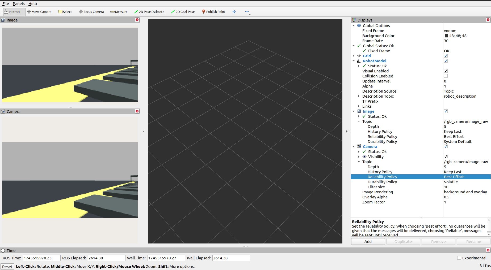
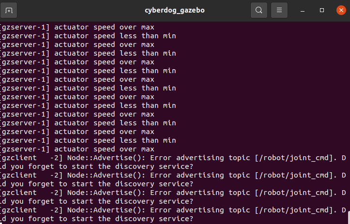
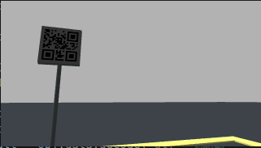

[TOC]

注意：执行`main1.py`之前不要忘记了激活ros环境
`source /opt/ros/galactic/setup.bash`

可参考网址汇总：
https://github.com/fan-ziqi/cyberdog_devel?tab=readme-ov-file

# 1. 仿真使用
*注意：请先关闭conda，退出conda环境，不然可能会有意想不到的错误！！！*
因为ros和anaconda调用了很多python的东西，它们版本不一样。
例子：
在conda环境下
`protoc --version`
输出 libprotoc 3.20.3
退出conda
`protoc --version`
输出 libprotoc 3.6.1
而整个编译的环境只能在libprotoc 3.6.1
如果编译的时候出现与protoc相关的问题，就检查一下版本。如果没有，就去安装一个3.6.1的包

## 1.1. 相关环境配置
- 安装docker,ros galactic
  https://docs.docker.com/engine/install/ubuntu/
  docker安装

  https://docs.ros.org/en/galactic/Installation/Ubuntu-Install-Debians.html

  - 可能出现的部分错误请查看相关文档[ros2安装](related_docs/ros2安装.md)
  - git、curl设置代理。[点击查看相关文档](related_docs/git、curl设置代理.md)
  - `curl -s https://raw.githubusercontent.com/ros/rosdistro/master/ros.asc | sudo apt-key add -`无法运行。[点击查看相关文档](related_docs/raw.github_error.md)
- 下载比赛压缩包
  https://pan.educg.net/s/L5myHM

- 本地导入 Docker 镜像（注意这只加载了镜像，但没有运行容器）
  `sudo docker load -i cyberdog_raceV2.tar`

- 运行 Docker 镜像来创建一个容器
  `sudo docker run -it --privileged=true -e DISPLAY=\$DISPLAY -v/tmp/.X11-unix:/tmp/.X11-unix cyberdog_sim:v2`

- 首先我们要把这个比赛docker展开，方便修改代码
  `sudo docker ps -a`用来显示所有容器的信息
  

- 使用`docker cp`将目录复制到本地
  - `docker cp 2096cacd4316:/home/cyberdog_sim ~/projects/sim`
  `/home/cyberdog_sim`是容器的源目录，`~/projects/sim`是本地目录
  但是文件会有锁，无法更改文件，需要更改文件权限方便后续操作

- `sudo chown -R username filename`
  `username`就是你Ubuntu系统安装的时候取得名字，`filename`就是被锁文件夹名字。

  例如 ```sudo chown -R coco libbpf``` 这个时候`libbpf`文件夹就被解锁而且里面的内容都不会被锁，也就是相当于是全部解锁。

- 进入`~/projects/sim/cyberdog_sim`文件夹，阅读`REDAME.md`,**安装依赖**
  
  注意安装lcm的时候可能报错
  
  可以不用管，直接make就行

- 仿真使用
  详见https://miroboticslab.github.io/blogs/#/cn/cyberdog_gazebo_cn
  **注意编译的时候要把`build`,`intall`,`log`这三个文件夹删掉再编译。**
  
  
  ```
  ## 下载
  $ git clone https://github.com/MiRoboticsLab/cyberdog_sim.git
  因为我们是从比赛压缩包下载的，里面有这个cyberdog_sim，应该就不用再git了，直接vcs展开即可
  $ cd cyberdog_sim
  $ vcs import < cyberdog_sim.repos

  ## 编译
  需要将src/cyberdog locomotion/CMakeLists.txt中的BUILD_ROS置为ON
  需要在cyberdog_sim文件夹下进行编译

  $ source /opt/ros/galactic/setup.bash 
  $ colcon build --merge-install --symlink-install --packages-up-to cyberdog_locomotion cyberdog_simulator


  ## 使用
  需要在cyberdog_sim文件夹下运行

  $ python3 src/cyberdog_simulator/cyberdog_gazebo/script/launchsim.py
  ```

  编译的时候可能会出现这个stderr，不用管。
  
  此时应该会弹出来几个控制台和GUI界面，但是此时**比赛场景加载不出来。**
  
  

  接着见官方文档的2.2.4仿真例程。

  在仿真程序中提供了`cyberdog_example`的仿真例程包，该包提供了`keybroad_commander`和`cyberdogmsg_sender`两个例程。 `keybroad_commander`演示了如何使用`gampad_lcmt`向控制发送基本控制指令 该程序运行方法如下： 需要在`cyberdog_sim`文件夹下运行

  ```
  $ source /opt/ros/galactic/setup.bash
  $ source install/setup.bash
  $ ./build/cyberdog_example/keybroad_commander
  ```

  运行后，可在终端输入对应的指令来控制机器人 

  ```
  键位 	指令 	键位 	指令
  w 	x方向速度增加最大速度的0.1倍 	i 	pitch方向速度增加最大速度的0.1倍
  s 	x方向速度减少最大速度的0.1倍 	k 	pitch方向速度减少最大速度的0.1倍
  d 	y方向速度增加最大速度的0.1倍 	l 	yaw方向速度增加最大速度的0.1倍
  a 	y方向速度减少最大速度的0.1倍 	j 	yaw方向速度减少最大速度的0.1倍
  e 	切换为QP站立模式(kp kd较小) 	t 	切换为缓慢趴下模式
  r 	切换为locomotion模式 	y 	切换为恢复站立模式
  ```

  输入r，进入键盘控制，输入w，狗向前移动，输入y，狗恢复站立。
  
  `cyberdogmsg_sender`演示了使用`/yaml_parameter`来对yaml文件中的控制参数进行实时修改，以及使用`/apply_force`来仿真中的机器人施加外力。 该程序的运行方法如下： 需要在`cyberdog_sim`文件夹下运行


  ```
  $ source /opt/ros/galactic/setup.bash
  $ source install/setup.bash
  $ ./build/cyberdog_example/cyberdogmsg_sender
  ```

  该例程先把参数`use_rc`置为0(该参数为1时为遥控模式，置为0后才能够通过仿真程序进行控制)；
  然后通过设置`control_mode`参数使机器人站立起来，并进入locomotion模式，即原地踏步(`control_mode`的参数可参阅控制程序的`control_flag.h`文件)；
  接着对机器人的左前小腿施加侧向的外力； 最后通过修改`des_roll_pitch_height`参数使机器人在踏步时roll角变为0.2弧度。

- 其他例程

  https://miroboticslab.github.io/blogs/#/cn/cyberdog_loco_cn?id=_24-%e6%8e%a5%e5%8f%a3%e7%a4%ba%e4%be%8b

  + 基本动作:

    在`cyberdog_sim/src/loco_hl_example/basic_motion`中运行`main.py`,控制机 器人依次完成站立，握手，作揖，抬头，低头，原地踏步旋转，趴下等动作。
    
    注意：依赖lcm数据类型文件`robot_control_cmd_lcmt.py`和`robot_control_response_lcmt.py`。
  

  + 序列动作:

    在`cyberdog_sim/src/loco_hl_example/sequential_motion`内
    实现控制机器人依次站立，调整高度，抬起右后腿，原地踏步旋转，趴下等动作

    注意：运行该Python脚本，依赖lcm数据类型文件`robot_control_cmd_lcmt.py`和序列动作文件`cyberdog2_ctrl.toml`。
  

  + 自定义步态:

    在`cyberdog_sim/src/loco_hl_example/customized_gait`文件夹中运行`main.py`.

    本例程是Python脚本，通过读取自定义步态文件和序列动作文件，实现控制机器人依次站立，太空步和趴下等动作。示例中`Gait_Params_moonwalk.toml` 文件包含2.2.2自定义步态相关参数介绍，脚本首先按一定映射关系将其编码为基本`robot_control_cmd_lcmt` 结构体序列(`Gait_Params_moonwalk_full.toml`)再下发。

    注意：运行该Python脚本，依赖lcm数据类型文件`robot_control_cmd_lcmt.py`和`file_send_lcmt.py`，自定义步态文件`Gait_Def_moonwalk.toml`和`Gait_Params_moonwalk.toml`，以及序列动作文件`Usergait_List.toml`。

## 1.2. 解决打开时赛道环境不显示的问题

如果是在docker里面打开的赛道，则可以正常显示。但因为我们是把docker的文件全部提取出来了，相对路径会有变化。所以会出现赛道环境不显示的问题。

解决办法：
  在`cyberdog_sim/src/cyberdog_simulator/cyberdog_gazebo/world`文件夹中，用vscode打开此文件夹。主要是在`race.world`里面更改。
  - `code .`
  然后`ctrl+F`搜索`/home`
  因为`/home`是docker容器里面的路径，这里我们要将他改为自己电脑里面的路径。
  在`cyberdog_sim/src/cyberdog_simulator/cyberdog_gazebo/world`文件夹中，输入`pwd`显示当前路径，复制`cyberdog_sim`前面的路径然后替换掉`/home`即可(**一定要是绝对路径，不能是相对路径**)
  
  
  再打开仿真，赛道就出现了（此时箭头，二维码仍没有）。
  

## 1.3. 解决箭头、二维码不显示的问题

压缩包里面有箭头、二维码的png图片，以及一个`gazebo.material`。
因为这些文件不在cyberdog_sim的相关文件夹里，所以提取出来没有。

gazebo安装路径一般是：`/usr/share/gazebo-11`

在`/usr/share/gazebo-11/media/materials/scripts`里面替换掉`gazebo.material`同名文件，二维码，箭头图片在放进`/usr/share/gazebo-11/media/materials/textures`里。

让`/usr/share/gazebo-11`获得写权限
  - `sudo chmod 777 /usr/share/gazebo-11`

然后打开仿真，发现有箭头，二维码了


注意：石板路有一点问题，想要更改此错误请去比赛官网找对应的解决方案。

## 1.4. rgb摄像头相关仿真使用

###  1.4.1. 在仿真平台中添加image订阅

打开ros
`source /opt/ros/galactic/setup.bash`

`cyberdog_sim/src/cyberdog_simulator/cyberdog_robot/cyberdog_description/xacro`文件夹里修改`gazebo.xacro`，添加

```
    <gazebo reference="RGB_camera_link">
        <sensor type="camera" name="rgb camera">
            <always_on>true</always_on>
            <update_rate>15.0</update_rate>
            <camera name="rgb_camera">
                <horizontal_fov>1.46608</horizontal_fov>
                <image>
                    <width>320</width>
                    <height>180</height>
                    <format>R8G8B8</format>
                </image>
                <distortion>
                    <k1>0.0</k1>
                    <k2>0.0</k2>
                    <k3>0.0</k3>
                    <p1>0.0</p1>
                    <p2>0.0</p2>
                    <center>0.5 0.5</center>
                </distortion>
            </camera>
            <plugin name="rgb_camera_plugin"
            filename="libgazebo_ros_camera.so">
                <ros>
                    <!-- <namespace>stereo</namespace> -->
                    <remapping>~/image_raw:=image_raw</remapping>
                    <remapping>~/camera_info:=camera_info</remapping>
                </ros>
                <!-- Set camera name. If empty, defaults to sensor
                name (i.e. "sensor_name") -->
                <camera_name>rgb_camera</camera_name>
                <!-- Set TF frame name. If empty, defaults to link
                name (i.e. "link_name") -->
                <frame_name>RGB_camera_link</frame_name><hack_baseline>0.2</hack_baseline>
            </plugin>
        </sensor>
    </gazebo> 
```

注意这段代码要添加到</robot>里面；注意缩进


然后添加订阅image

需要安装一个依赖包

`sudo apt install ros-galactic-gazebo-ros-pkgs`

检查这个包是否安装成功，在`/opt/ros/galactic/lib`里寻找是否有`libgazebo_ros_camera.so`这个依赖文件。

```
find /opt/ros/galactic/lib -name "libgazebo_ros_camera.so" 
or 
ls /opt/ros/galactic/lib | grep "libgazebo_ros_camera.so"
```

然后可以先`ros2 topic list`看看是否有订阅。如果没有则重新编译src,然后可以看到摄像头了。

要有rgb carema/下面的四个话题（或两个？）有启动成功了

然后运行仿真程序，运行仿真程序后可通过 `window->Topic Visualization` 中找到对应 topic 并打开,可确认rgb相机正常运行


通过 `ros2 topic list`可确认 topic 正常发送


#### 补充：

处理图像一般用的cv，我们需要写一个包`img_work`来把订阅的图像转成cv格式。

如果要开其他传感器的话，也是一样，可以查看cyberdog_sim的README文件
`cyberdog/src/cyberdog_simulator/cyberdog_gazebo/script`看`launchsim.py`


这里补充图片。我们启动的是这三个脚本
找`launchgazebo.sh`，补充图片，可以看到用了ros的`race_gazebo.launch.py`，这个文件在`cyberdog/src/cyberdog_simulator/cyberdog_gazebo/launch`里，这个文件可以看到各个参数的定义，以后想改就到这个文件里面改。

激光雷达。目前没用，去年因为有墙，才用了雷达。
把use_lidar这里自己写个临时变量，改为true就可以

<!-- `cyberdog/src/cyberdog_simulator/cyberdog_robot/cyberdog_description/xacro` -->

### 1.4.2. 在rivz中可视化

在 Add 中 By topic 点击`/image_raw/Image`和`/image_raw/Camera`
在Displays的image中，把topic的Reliability Policy改为Best effort，同理，在Camera中，topic的Reliability Policy改为Best effort。


## 1.5. 赛道仿真运行

相关文件见压缩包。

`main1.py`依赖于这两个文件`robot_control_cmd_lcmt.py`和`robot_control_response_lcmt.py`，因为是通过lcm传信息的。然后是自定义文件`CtrlBase.py`，`NodeBase.py`,`TaskRunner.py`。

把`cyberdog2_user80_ballet.toml`（限高杆）,`cyberdog2_user81_ballet.toml`（上坡）,`cyberdog2_user82_ballet.toml`（下坡）替换`cyberdog_sim/src/cyberdog_locomotion/control/motion_list/cyberdog2/user/parameter`的对应文件。
把`user_gait_00.toml`（限高杆）,`user_gait_01.toml`（上坡）,`user_gait_02.toml`（下坡）替换`cyberdog_sim/src/cyberdog_locomotion/control/motion_list/cyberdog2/user/define`的对应文件。

注意：执行`main1.py`之前不要忘记了激活ros环境
`source /opt/ros/galactic/setup.bash`

运行`main1.py` 
`python3 main1.py`
然后狗开始运动

# 错误汇总

## 1.狗走着走着，有时候gazebo报错roslaunch gazebo_ros empty_world.launch

这是我在对main.py进行模块化的时候遇到的问题，仍然不知道怎么解决
建议不要以后不要尝试对代码进行模块化，除非你对gazebo和ros非常了解

## 2.仿真无法识别二维码

问题原因：
1. ROS（如 ROS Noetic / ROS2 Foxy） 中运行 OpenCV 的 cv2.QRCodeDetector().detectAndDecode() 无法成功检测二维码，最常见原因是：OpenCV 编译时未启用 QUIRC 模块。ROS 安装时自带的 OpenCV（通常是系统自带的 OpenCV）是以禁用 QUIRC 解码库编译的，导致：cv2.QRCodeDetector().detectAndDecode(...)即使可以检测二维码区域，但不会返回内容，并输出类似：Library QUIRC is not linked. No decoding is performed.
2. 二维码：
有明显的倾斜；
周围对比度不强（背景与二维码颜色相近）；
可能是仿真生成的（如 Gazebo、Unity 里）二维码图像不够清晰锐利；
而 pyzbar 对这种图像 识别鲁棒性差，尤其是：
倾斜 + 模糊 + 对比度不足

解决方式：把二维码裁取出来传送给QRdetect，不要传整个图片给QRdetect。然后咱们的这个opencv库编译的时候应该没有编译QUIRC 模块，所以不能用cv2.QRCodeDetector().detectAndDecode(...)，得用pyzbar 替代 OpenCV 解码

原错误相关代码
```
# main.py class VisionNode ：
    def _detect_4(self, cv_image):
        hsv = cv2.cvtColor(cv_image, cv2.COLOR_BGR2HSV)
        height, width = hsv.shape[:2]
        
        lower_dark = np.array([0, 0, 0])
        upper_dark = np.array([180, 255, 60])
        mask = cv2.inRange(hsv, lower_dark, upper_dark)
        
        kernel = np.ones((5,5), np.uint8)
        mask = cv2.morphologyEx(mask, cv2.MORPH_OPEN, kernel)
        
        contours, _ = cv2.findContours(mask, cv2.RETR_EXTERNAL, cv2.CHAIN_APPROX_SIMPLE)
        max_side = 0
        
        if len(contours) > 0:
            contours = sorted(contours, key=cv2.contourArea, reverse=True)[:3]
            
            for contour in contours:
                epsilon = 0.02 * cv2.arcLength(contour, True)
                approx = cv2.approxPolyDP(contour, epsilon, True)
                
                if 4 <= len(approx) <= 6:
                    rect = cv2.minAreaRect(contour)
                    box = cv2.boxPoints(rect)
                    box = np.int_(box)
                    
                    side1 = np.linalg.norm(box[0]-box[1])
                    side2 = np.linalg.norm(box[1]-box[2])
                    current_max_side = max(side1, side2)
                    
                    aspect_ratio = max(side1, side2) / (min(side1, side2) + 1e-5)
                    if 0.8 < aspect_ratio < 1.2: 
                        if current_max_side > max_side:
                            max_side = current_max_side
                            # print(f"检测到边长: {max_side:.1f}")
                            max_contour = contour
        
        with self._lock:
            if max_side > 46:  # 边长阈值
                self._max_side_length = max_side
                self._detected_flags['4'] = True
            else:
                self._max_side_length = 0
                self._detected_flags['4'] = False

        # 调试显示
        if self.debug_mode and 'max_contour' in locals():
            debug_img = cv2.cvtColor(hsv, cv2.COLOR_HSV2BGR)
            cv2.drawContours(debug_img, [max_contour], -1, (0,255,0), 2)
            cv2.putText(debug_img, f"Quad Side: {max_side:.1f}", (10,30),
                        cv2.FONT_HERSHEY_SIMPLEX, 1, (0,0,255), 2)
            cv2.imshow("Detection Preview", debug_img)
            cv2.waitKey(1)

    def _detect_4_5(self, cv_image):
        qr_data = self.QRCodeDetector.detect_qrcode(cv_image)
        with self._lock:
            self._detected_flags['4_5'] = (qr_data is not None)


# NodeBase.py class QRCodeDetector:
    #得到信息
    def detect_qrcode(self,origin_frame): 
        if origin_frame is None:
            print("NodeBase.py QRCodeDetector Class Error:detect_qrcode:fail to grab image")
            return

        codeinfo = None
        result_frame = np.copy(origin_frame)
        gray_frame = cv2.cvtColor(origin_frame, cv2.COLOR_BGR2GRAY)
        codeinfo, imagePoints, straight_qrcode = self.qrcoder.detectAndDecode(gray_frame)
        if codeinfo:
            print(f"information: {codeinfo}")
            self.result = codeinfo
            #solvepnp
            rvec = np.zeros((3, 1), dtype=np.float32)
            tvec = np.zeros((3, 1), dtype=np.float32)
    
            success, rvec, tvec = cv2.solvePnP(self.objectPoints, imagePoints, self.InnerMatrix, self.distCoeffs)
            # # 绘制
            # if success:
            #     cv2.drawFrameAxes(result_frame, InnerMatrix, distCoeffs, rvec, tvec, 100)
        else:
            print("NodeBase.py QRCodeDetector Class Error:detect_qrcode:fail to detect qrcode!")
        return self.result

```
```
# main.py class VisionNode ：
    # 检测大致为正方形的黑色目标
    def _detect_4(self, cv_image):
        hsv = cv2.cvtColor(cv_image, cv2.COLOR_BGR2HSV)
        height, width = hsv.shape[:2]
        
        lower_dark = np.array([0, 0, 0])
        upper_dark = np.array([180, 255, 60])
        mask = cv2.inRange(hsv, lower_dark, upper_dark)
        
        kernel = np.ones((5,5), np.uint8)
        mask = cv2.morphologyEx(mask, cv2.MORPH_OPEN, kernel)
        
        contours, _ = cv2.findContours(mask, cv2.RETR_EXTERNAL, cv2.CHAIN_APPROX_SIMPLE)
        max_side = 0
        
        if len(contours) > 0:
            contours = sorted(contours, key=cv2.contourArea, reverse=True)[:3]
            
            for contour in contours:
                epsilon = 0.02 * cv2.arcLength(contour, True)
                approx = cv2.approxPolyDP(contour, epsilon, True)
                
                if 4 <= len(approx) <= 6:
                    rect = cv2.minAreaRect(contour)
                    box = cv2.boxPoints(rect)
                    box = np.int_(box)
                    
                    side1 = np.linalg.norm(box[0]-box[1])
                    side2 = np.linalg.norm(box[1]-box[2])
                    current_max_side = max(side1, side2)
                    
                    aspect_ratio = max(side1, side2) / (min(side1, side2) + 1e-5)
                    if 0.8 < aspect_ratio < 1.2: 
                        if current_max_side > max_side:
                            max_side = current_max_side
                            # print(f"检测到边长: {max_side:.1f}")
                            max_contour = contour
        
        with self._lock:
            if max_side > 39:  # 边长阈值
                self._max_side_length = max_side
                self._detected_flags['4'] = True
            else:
                self._max_side_length = 0
                self._detected_flags['4'] = False

        # 调试显示
        if self.debug_mode and 'max_contour' in locals():
            debug_img = cv2.cvtColor(hsv, cv2.COLOR_HSV2BGR)
            cv2.drawContours(debug_img, [max_contour], -1, (0,255,0), 2)
            cv2.putText(debug_img, f"Quad Side: {max_side:.1f}", (10,30),
                        cv2.FONT_HERSHEY_SIMPLEX, 1, (0,0,255), 2)
            cv2.imshow("Detection Preview", debug_img)
            cv2.waitKey(1)

            # === 提取轮廓最小外接矩形区域（即二维码可能区域） ===
            x, y, w, h = cv2.boundingRect(max_contour)
            roi = cv_image[y:y+h, x:x+w]  # 注意用原图的 BGR 图像裁剪

            # 将裁剪区域传给 detect_4_5 检测二维码
            self._detect_4_5(roi)

    # 检测二维码
    # 该函数使用 pyzbar 库检测图像中的二维码，并将识别结果存储在 _detected_flags['4_5'] 中。
    # 若检测到二维码，则返回 True，否则返回 False。
    def _detect_4_5(self, cv_image):
        qr_data = self.QRCodeDetector.detect_qrcode(cv_image)
        print(f"二维码检测结果: {qr_data}")
        with self._lock:
            self._detected_flags['4_5'] = (qr_data is not None)
            print(f"二维码检测标识位更新为: {self._detected_flags['4_5']}")

# NodeBase.py class QRCodeDetector:
    def detect_qrcode(self, origin_frame): 
        if origin_frame is None:
            print("QRCodeDetector Error: no frame")
            return

        result_frame = np.copy(origin_frame)

        # 转为灰度图以提高识别成功率
        gray = cv2.cvtColor(origin_frame, cv2.COLOR_BGR2GRAY)
        gray = cv2.equalizeHist(gray)  # 对比度增强，可选

        decoded_objects = pyzbar.decode(gray)

        cv2.imshow("QRCode Frame", result_frame)
        cv2.waitKey(1)

        if decoded_objects:
            obj = decoded_objects[0]
            self.result = obj.data.decode('utf-8')
            print(f"information: {self.result}")

            points = obj.polygon
            if len(points) == 4:
                imagePoints = np.array(points, dtype=np.float32)
                rvec = np.zeros((3, 1), dtype=np.float32)
                tvec = np.zeros((3, 1), dtype=np.float32)
                success, rvec, tvec = cv2.solvePnP(
                    self.objectPoints, imagePoints,
                    self.InnerMatrix, self.distCoeffs
                )
        else:
            print("QRCodeDetector: no qrcode detected.")

        return self.result
```

