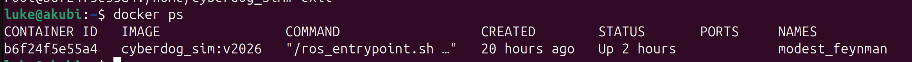
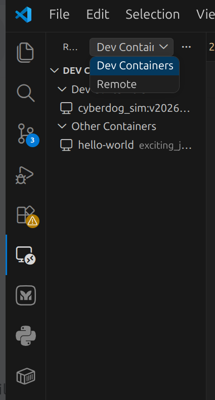
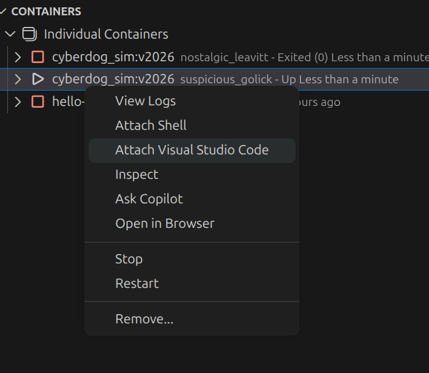

先下载插件
vscode下载docker,dev container

进入终端
```
luke@akubi:~$ docker --version
Docker version 29.3.0, build 5927d80
luke@akubi:~$ docker ps
permission denied while trying to connect to the docker API at unix:///var/run/docker.sock
luke@akubi:~$ sudo usermod -aG docker $USER
```

说明 Docker 已经装好了，但当前用户 luke 没有权限访问 Docker socket
先把当前用户加入 docker 用户组：

```
sudo usermod -aG docker $USER
```

重启电脑
再次`docker ps`


# 用cmd编辑

不建议用cmd,建议用vscode

注意如果你参照的 [Gazebo仿真平台技术.docx](Gazebo仿真平台技术.docx),里面会有
`
sudo docker run -it --shm-size="1g" --privileged=true -e DISPLAY=$DISPLAY -v /tmp/.X11-unix:/tmp/.X11-unix cyberdog_sim:v1
`

注意docker run和docker exec的区别

`docker run ... cyberdog_sim:v2026`：创建并启动一个新容器
`docker exec -it suspicious_golick /bin/bash`：进入一个已经运行的旧容器


建议仅第一次用docker run,后面如果用cmd进入容器的话,用docker exec进入,不要用docker run了,这会新建一个容器.

# 用vscode 编辑





点attach vscode
然后就可以修改代码了

进入后

```
cd /home/cyberdog_sim
python3 src/cyberdog_simulator/cyberdog_gazebo/script/launchsim.py
```

然后参考26文档 `# 如何在容器内开发`

可参考文档
[Gazebo仿真平台技术.docx](Gazebo仿真平台技术.docx)
[cyberdog_race说明文档.docx](cyberdog_race说明文档.docx)
