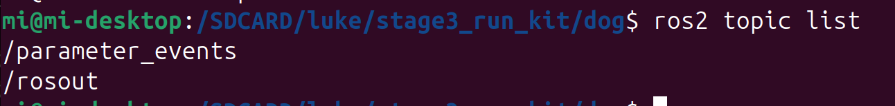

# 问题描述

ros2 topic list

已登录 172.20.10.2 检查。原因不是相机程序没启动，而是 ROS2 的 CycloneDDS discovery 配置异常。

检查结果：

- CyberDog 主程序正在运行。
- stereo_camera 进程正在运行，PID 9471。
- 实际 namespace 是：

/mi_desktop_48_b0_2d_5f_be_5c

- ROS2 环境正确加载为：

ROS_DISTRO=galactic
ROS_DOMAIN_ID=42
RMW_IMPLEMENTATION=rmw_cyclonedds_cpp
CYCLONEDDS_URI=file:///etc/mi/cyclonedds.xml

问题出在 /etc/mi/cyclonedds.xml：

<NetworkInterfaceAddress>wlan0</NetworkInterfaceAddress>
...
<Peer address="localhost"/>

DDS 被强制绑定到 wlan0，但发现目标却是 localhost/127.0.0.1。运行日志持续出现：

ddsi_udp_conn_write to udp/127.0.0.1:xxxxx failed

因此各 ROS2 节点虽然进程存在，却互相发现不了。无论使用 ROS2 daemon，还是 --no-daemon 直接查询，都只能看到：

/parameter_events
/rosout

所以目前无法调用：

改成：

<Peer address="172.20.10.2"/>

这会修改系统配置并重启机器狗 ROS2 服务，属于有影响的操作；我目前没有执行。修复前也不要运行 Stage3，因为相机服务和图像话题都无法发现。

# 详细解释一下`<Peer address="localhost"/>和<Peer address="172.20.10.2"/>`的原理

• 先给结论：

  - <Peer address="localhost"/>：把 DDS 发现报文发送到本机回环地址 127.0.0.1。
  - <Peer address="172.20.10.2"/>：把 DDS 发现报文发送到机器狗的 WLAN 地址。
  - Peer 不是 ROS2 服务地址，也不是图像数据地址，而是 CycloneDDS 寻找其他 DDS 参与者时使用的“初始联系地址”。

  在你的机器狗上，CycloneDDS又被强制绑定到 wlan0。因此 localhost 属于 lo 回环网卡，而不是 wlan0，两项配置存在冲突；改为 172.20.10.2 后，Peer 地址与所选 WLAN 接
  口处于同一网络路径。

  ## 1. ROS2 节点为什么需要 Peer

  ROS2 的节点启动后，不会自动知道其他节点在哪里。

  例如：

  stereo_camera
  vision_manager
  ros2 daemon
  dog_rgb_bridge

  这些进程首先都只是独立的 DDS participant。它们需要经过两个发现阶段：

  SPDP：发现有哪些 DDS participant
    ↓
  SEDP：交换 topic、service、publisher、subscriber 信息
    ↓
  建立实际数据通信

  CycloneDDS 默认通常通过组播地址 239.255.0.1发送 SPDP 发现消息。Peers 则提供额外的静态单播发现地址：每次发送 SPDP 时，除了默认组播，也向配置的 Peer
  地址发送。CycloneDDS 官方发现说明 (https://cyclonedds.io/docs/cyclonedds/latest/config/discovery-config.html)

  所以：

  <Peers>
      <Peer address="172.20.10.2"/>
  </Peers>

  大致相当于告诉 CycloneDDS：

  > 除了尝试组播发现，也主动到 172.20.10.2 上寻找同一 DDS Domain 的参与者。

  ## 2. localhost 到底是什么

  操作系统通常会把：

  localhost

  解析为：

  127.0.0.1

  有时还可能包含 IPv6：

  ::1

  127.0.0.1 属于回环接口：

  lo → 127.0.0.1

  发送到它的数据不会进入物理网卡，也不会进入 Wi-Fi：

  程序 A
    → 127.0.0.1
    → Linux 本机协议栈
    → 程序 B

  因此下面的配置通常表示“主动发现同一台机器上的 DDS 进程”：

  <Peer address="localhost"/>

  如果 CycloneDDS同时使用回环接口，这种配置是合理的。

  官方文档也说明，将 DDS 网络接口设为 127.0.0.1 会把通信限制在本机。CycloneDDS 配置指南 (https://cyclonedds.io/docs/cyclonedds/latest/config/index)

  ## 3. 172.20.10.2 是什么

  在这台机器狗上：

  wlan0 = 172.20.10.2/28

  因此：

  <Peer address="172.20.10.2"/>

  表示向机器狗自己的 WLAN 地址发送 DDS 发现报文。

  虽然这个地址仍属于本机，但它代表的是 WLAN 网络身份：

  机器狗程序
    → 172.20.10.2
    → 本机 WLAN 地址
    → 对应 DDS participant

  它还有另一个意义：局域网中的其他设备也可以使用这个地址联系机器狗，例如 PC 可以把机器狗配置为：

  <Peer address="172.20.10.2"/>

  从而在组播不可用时，通过单播开始发现机器狗上的 ROS2 节点。

  ## 4. 为什么当前 localhost 会出问题

  机器狗的完整配置是：

  <General>
      <NetworkInterfaceAddress>wlan0</NetworkInterfaceAddress>
      <AllowMulticast>true</AllowMulticast>
  </General>

  <Discovery>
      <ParticipantIndex>auto</ParticipantIndex>
      <MaxAutoParticipantIndex>256</MaxAutoParticipantIndex>
      <Peers>
          <Peer address="localhost"/>
      </Peers>
  </Discovery>

  关键是下面两项组合：

  通信接口：wlan0
  Peer 地址：localhost → 127.0.0.1 → lo

  关系如下：

  CycloneDDS 被要求从 wlan0 通信
                  │
                  └── 却要向 127.0.0.1 发送发现报文
                               │
                               └── 127.0.0.1 只属于 lo

  CycloneDDS只启用一个非回环接口时，对回环地址的使用会受到限制。官方网络接口说明指出，loopback 地址通常会被忽略，除非只启用了
  loopback、没有其他地址可用，或者满足特定本机地址条件。CycloneDDS 网络接口说明 (https://cyclonedds.io/docs/cyclonedds/latest/config/network_interfaces.html)

  在这台狗上，实际日志已经证实发送失败：

  ddsi_udp_conn_write to udp/127.0.0.1:18222 failed with retcode -1
  ddsi_udp_conn_write to udp/127.0.0.1:18224 failed with retcode -1
  ...

  所以这里不是纯理论推测：CycloneDDS确实尝试通过当前配置联系 127.0.0.1，而发送失败。

  ## 5. 为什么它尝试了大量端口

  当前配置还有：

  <ParticipantIndex>auto</ParticipantIndex>
  <MaxAutoParticipantIndex>256</MaxAutoParticipantIndex>

  如果 Peer 只写 IP、没有写端口：

  <Peer address="localhost"/>

  CycloneDDS不知道目标 participant 使用哪个 DDS discovery UDP 端口，于是会根据 participant index 枚举一系列端口：

  127.0.0.1:17910
  127.0.0.1:17912
  127.0.0.1:17914
  ...

  Domain ID 是 42，DDSI 端口会根据 Domain ID 和 participant index 计算，因此日志中出现了：

  18222
  18224
  18226
  ...

  官方文档说明，不带端口的 Peer 地址会针对 participant index 范围生成多个目标端口；MaxAutoParticipantIndex 决定搜索范围。CycloneDDS Peer 配置参考
  (https://cyclonedds.io/docs/cyclonedds/latest/config/config_file_reference.html)

  因此你看到大量连续的偶数 UDP 端口，不代表系统启动了几百个服务，而是 CycloneDDS正在扫描可能的 participant discovery 端口。

  ## 6. 改成自身 IP 后发生什么

  改为：

  <Peer address="172.20.10.2"/>

  配置关系变成：

  CycloneDDS 网络接口：wlan0
  wlan0 地址：172.20.10.2
  Peer 地址：172.20.10.2

  这时接口和地址一致：

  stereo_camera
      │ SPDP 单播
      ▼
  172.20.10.2:发现端口
      │
      ▼
  同机其他 CycloneDDS participant

  当一个 participant 收到对方的 SPDP 后，会获得对方公布的地址，并开始反向发送自己的发现信息。官方文档将这种机制称为 asymmetrical
  discovery：即使只有一侧最初配置了对方，收到发现消息后也可能建立双向发现。CycloneDDS 发现机制
  (https://cyclonedds.io/docs/cyclonedds/latest/config/discovery-config.html)

  随后：

  1. stereo_camera 和其他节点互相发现。
  2. 通过 SEDP 交换 endpoint 信息。
  3. ros2 node list 能列出节点。
  4. ros2 service list 能看到生命周期服务。
  5. ros2 topic list 能看到 /image_left 和 /image_right。
  6. dog_rgb_bridge.py 才能订阅相机图像。

  ## 7. Peer 不等于所有数据都经过该地址

  这是最容易误解的地方。

  Peer 主要用于启动发现过程：

  Peer 地址
     │
     └── 发送 SPDP：“我在这里，你是谁？”

  成功发现之后，双方会交换真实可达地址、端口和 endpoint 信息。后续图像、Service 请求、Topic 数据，通常直接按照双方公布的 locator 通信。

  因此：

  <Peer address="172.20.10.2"/>

  并不是说：

  > 所有 ROS2 图像都必须经过某个运行在 172.20.10.2 上的中心服务器。

  DDS没有这样的中心服务器。每个 participant 仍然直接通信。

  ## 8. Peer 和组播的关系

  当前配置启用了：

  <AllowMulticast>true</AllowMulticast>

  理论上存在两条发现路径：

  路径一：组播
  participant → 239.255.0.1 → 同 Domain 的所有监听者

  路径二：静态 Peer 单播
  participant → 172.20.10.2 → 指定主机

  Peer 是“附加于或替代组播”的发现地址，不一定会关闭组播。

  如果热点、Wi-Fi 驱动、防火墙或 AP 隔离导致组播不可靠，静态 Peer 单播尤其重要。你这台狗当前表现为组播也没有让本机节点正确互相发现，因此错误的 localhost Peer
  就更加明显。

  ## 9. 两种配置分别适合什么场景

  ### 使用 localhost

  适合：

  只需要同一台主机内部通信
  CycloneDDS启用了 lo
  不需要 PC 通过 WLAN 发现 ROS2

  较合理的配套配置是只使用回环接口，例如：

  <General>
      <NetworkInterfaceAddress>127.0.0.1</NetworkInterfaceAddress>
  </General>
  <Discovery>
      <Peers>
          <Peer address="localhost"/>
      </Peers>
  </Discovery>

  这种配置不能让外部 PC 直接发现机器狗 ROS2 节点。

  ### 使用 172.20.10.2

  适合：

  CycloneDDS绑定 wlan0
  机器狗需要通过 WLAN 进行 DDS discovery
  Wi-Fi 组播可能不稳定
  PC 或本机进程需要通过 WLAN 地址发现机器狗

  例如：

  <General>
      <NetworkInterfaceAddress>wlan0</NetworkInterfaceAddress>
      <AllowMulticast>true</AllowMulticast>
  </General>
  <Discovery>
      <ParticipantIndex>auto</ParticipantIndex>
      <MaxAutoParticipantIndex>256</MaxAutoParticipantIndex>
      <Peers>
          <Peer address="172.20.10.2"/>
      </Peers>
  </Discovery>

  ## 10. 为什么临时改环境变量没有立即恢复现有节点

  我之前进行过一次只对新命令生效的测试，把新启动的 ROS2 CLI Peer 临时设为 172.20.10.2，但仍没有发现现有节点。

  原因是：

  新 ros2 CLI：使用新配置
  现有 stereo_camera：仍使用启动时读入的旧配置
  现有 vision_manager：仍使用旧配置
  其他现有节点：仍使用旧配置

  CycloneDDS配置通常在 participant 创建时读取。修改 XML 或临时环境变量不会自动重配已经运行的节点。

  所以完整修复需要：

  修改 /etc/mi/cyclonedds.xml
            ↓
  停止旧 ROS2 participant
            ↓
  重新启动 CyberDog ROS2 bringup