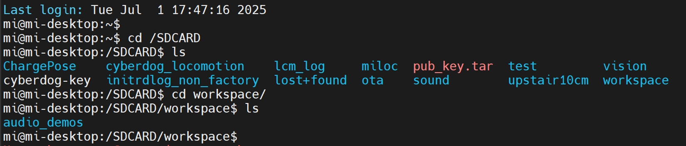
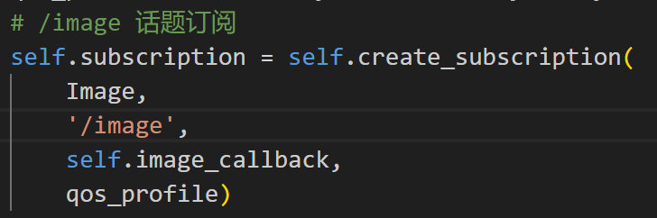
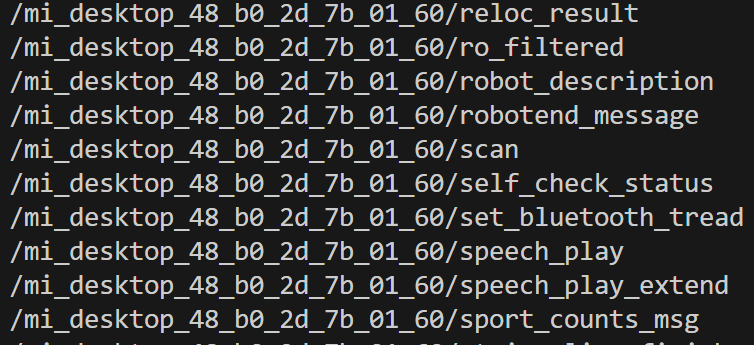
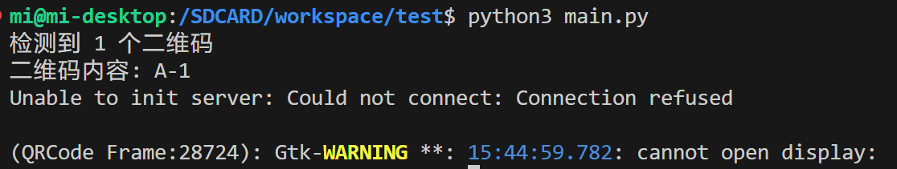

[TOC]



```
cd /SDCARD
ls
cd workspace
ls
# 有对应文件就不用创建，没有就创建
```

注意狗的环境可能少一些包，得自己安装
opencv版本别太高，建议用apt装，不要用pip3装，pip3大概率会失败
```
sudo apt update
sudo apt install libopencv-dev python3-opencv
```
装python包要指定pip3，不要用pip，不然会默认python2


# 若要启动AI相机（这个不太好使，画面传送不稳定，不要用）
终端1：ros2 run camera_test camera_server
终端2：ros2 service call /camera_service protocol/srv/CameraService "{command: 9, width: 640, height: 480, fps: 0}"

两个终端都是狗上,终端1一直有输出就是启动成功了

自己主机终端运行`export ROS_DOMAIN_ID=42`
`ros2 topic list`看看有没有节点
ros通信是在同一网段下的，如果你用的是虚拟机，仍没看到image_等节点，大概率虚拟机不是用的桥接模式，与狗不在同一网段（虚拟机ip地址和外面电脑的ip也不一样）把虚拟机改成桥接模式看看，如果不行就换双系统吧。

同时图像订阅得改成ros2 topic list对应的节点，这里是image，根据具体情况改就行


# 若要启动普通相机
```
ros2 lifecycle set /mi_desktop_48_b0_2d_7b_01_60/camera/camera configure
ros2 lifecycle set /mi_desktop_48_b0_2d_7b_01_60/camera/camera activate
ros2 lifecycle set /mi_desktop_48_b0_2d_7b_01_60/stereo_camera configure
ros2 lifecycle set /mi_desktop_48_b0_2d_7b_01_60/stereo_camera activate
```
mi_desktop这部分根据自己的情况更改，可以通过`ros2 topic list`查看

订阅改成'/mi_desktop_48_b0_2d_7b_01_60/image_rgb';
同时这个相机配置也要改一下


# pip3报错UTF-8无法解码
每条狗基本都有这个问题：
pip3安装报UTF-8的错的时候运行`sudo rm /etc/mr813_version`就行了
```
$ pip3 --version
Traceback (most recent call last):
  File "/usr/bin/pip3", line 9, in <module>
    from pip import main
  File "/usr/lib/python3/dist-packages/pip/__init__.py", line 22, in <module>
    from pip._vendor.requests.packages.urllib3.exceptions import DependencyWarning
  File "/usr/lib/python3/dist-packages/pip/_vendor/__init__.py", line 64, in <module>
    vendored("distro")
  File "/usr/lib/python3/dist-packages/pip/_vendor/__init__.py", line 33, in vendored
    __import__(modulename, globals(), locals(), level=0)
  File "<frozen importlib._bootstrap>", line 971, in _find_and_load
  File "<frozen importlib._bootstrap>", line 955, in _find_and_load_unlocked
  File "<frozen importlib._bootstrap>", line 656, in _load_unlocked
  File "<frozen importlib._bootstrap>", line 626, in _load_backward_compatible
  File "/usr/share/python-wheels/distro-1.0.1-py2.py3-none-any.whl/distro.py", line 1051, in <module>
  File "/usr/share/python-wheels/distro-1.0.1-py2.py3-none-any.whl/distro.py", line 596, in __init__
  File "/usr/share/python-wheels/distro-1.0.1-py2.py3-none-any.whl/distro.py", line 996, in _get_distro_release_info
  File "/usr/share/python-wheels/distro-1.0.1-py2.py3-none-any.whl/distro.py", line 1019, in _parse_distro_release_file
  File "/usr/lib/python3.6/codecs.py", line 321, in decode
    (result, consumed) = self._buffer_decode(data, self.errors, final)
UnicodeDecodeError: 'utf-8' codec can't decode byte 0xff in position 458: invalid start byte
```
## 问题原因：
你当前的 /usr/bin/pip3 仍然是系统自带的老版本 pip，且它依赖的 distro 模块读取系统发行版信息文件时出现了编码错误（UnicodeDecodeError），导致 pip 完全无法运行。
## 根本问题：
pip 内部调用 distro 来获取系统信息（读取 /etc/*-release 文件）时，遇到某个文件包含非 UTF-8 编码字节（比如 0xff）。
这很可能是 /etc/lsb-release 或其他发行版信息文件被破坏或带有乱码。
因为 pip3 依赖系统环境，导致不能正常使用。
## 解决方式：
```
sudo grep -rIl --exclude-dir={proc,sys} $'\xFF' /etc
/etc/console-setup/compose.ISO-8859-15.inc
/etc/console-setup/compose.ISO-8859-14.inc
/etc/console-setup/compose.ISO-8859-2.inc
/etc/console-setup/compose.ISO-8859-1.inc
/etc/console-setup/compose.ISO-8859-3.inc
/etc/console-setup/compose.ISO-8859-9.inc
/etc/console-setup/compose.ISO-8859-13.inc
/etc/console-setup/compose.ISO-8859-4.inc
/etc/mr813_version
```
可以看到/etc下面所有含有乱码的文件，去掉`mr813_version`即可
`sudo rm /etc/mr813_version`

# debug_mode 得改成False


狗没有图形界面，imshow会报错，把imshow都注释掉（debug_mode改为false）

# 多机通信

在/etc/mi里面，更改cyclonedds.xml，把lo改成wlan0,false改为true,在vscode里面修改没有sudo权限，可以在cmd里sudo vim改
，两个文件改完，狗得重启
在狗终端里面输入echo $ROS_DOMAIN_ID查看域ID，比如这里输出42，在同一个网段下，给自己电脑网络配置相同的ID export ROS_DOMAIN_ID=42，然后ros2 topic list查看输出， 