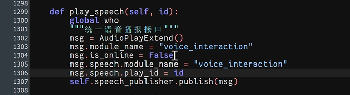
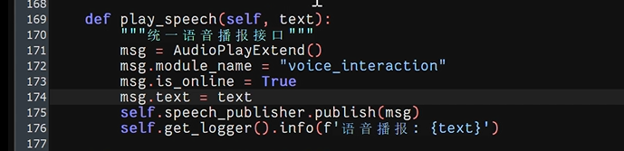
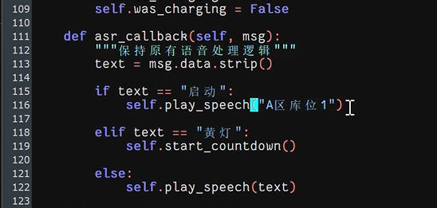
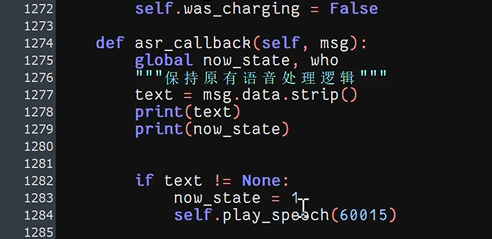
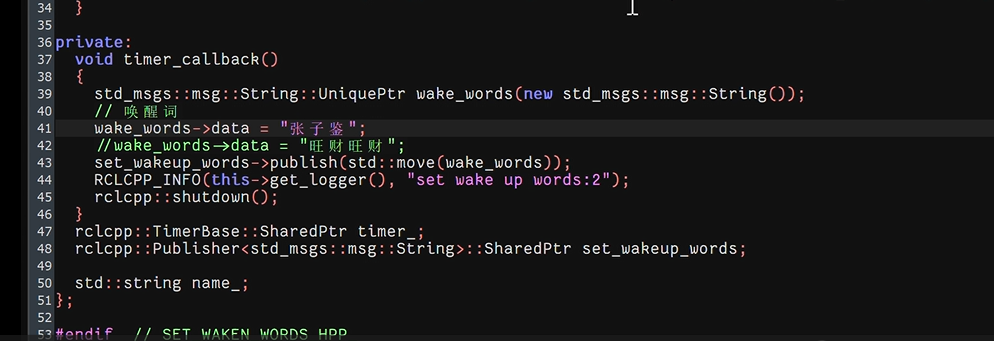
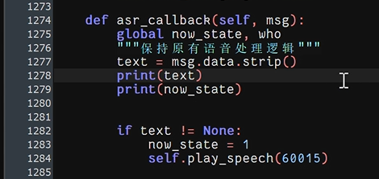
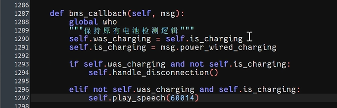
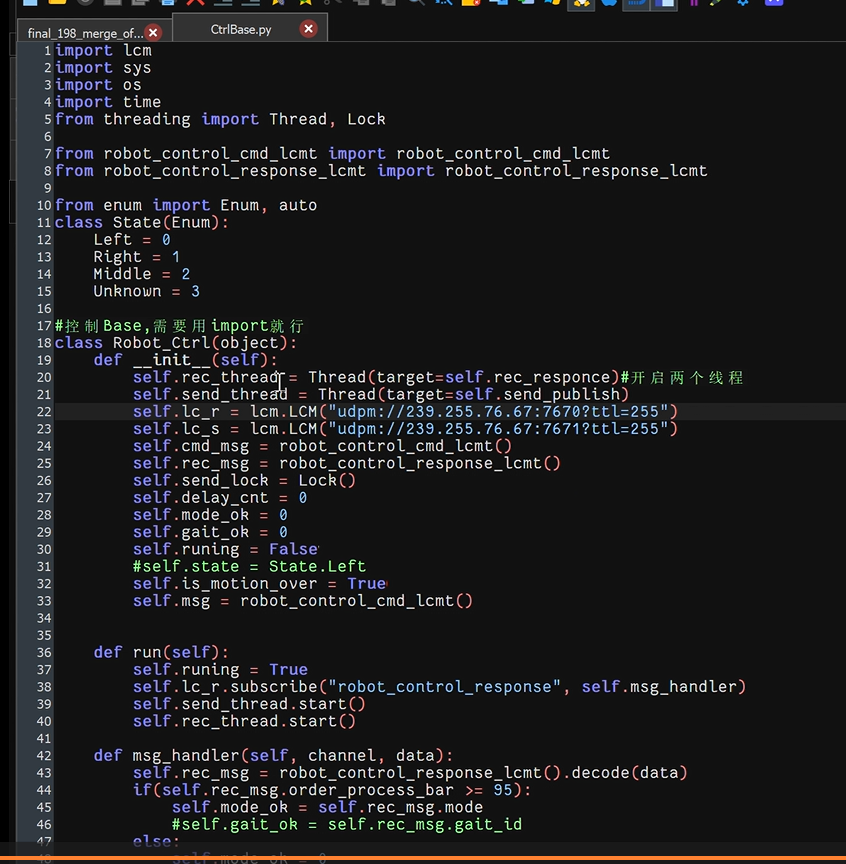

cd sound/yaml
编辑sound.toml
cd sound/music

文件一定要放在SDCARD文件夹里面，这个有32G，其他的地方特别小，千万不要放在其他地方了

动作不要用函数写，就用最原始的状态，步态，速度，方向，不要把这些放在一个函数里面了，大概率会有bug

state = 4.5

cd run 跑final_198_merge_offline.py

狗自带的语音包，需要网
SpeechProcessor()

联网要把play_speech()的msg.is_online改成True，msg_speech.play_id也要改，可以直接把给的字符串念出来，单元测试，voice.py

不联网要把play_speech()的msg.is_online改成False，断网后的识别率特别低，现在是判断一个文字对还是不对

msg_speech.play_id = id,这是预制好的语音

此逻辑，如果听到启动，播报A区库位1

有唤醒词 ， 这里是“张子鉴”
所以这里得说“张子鉴，启动”，狗播报“A区库位1”，这里张子健是已经提前编译好的，所以判断准确度还行，但是其他的话基本判断不出来

最后一个else是重复你的话

当时写的逻辑，只要听到张子健，然后再听到任何一个字，就判断已经交互了。

SDCARD/worksapce_0716/src/audio_demos/include/set_waken_words.hpp

唤醒词 张子健 或者 牢大牢大 都很好使 然后保存

进 /SDCARD/workspace_0716 执行  colcon build --merge-install

编译完后运行SDCARD/worksapce_0716/src/audio_demos/README.md的代码就行

如果要迁移worksapce0716改名，修改等，要把SDCARD/worksapce_0716/src/下的build,install,log全部删了，或者是SDCARD/worksapce_0716的build,install,log。忘了

当时还试了手势识别，在galaxy-fds-sdk-cpp，poco-1.7.8-all,googletest。googletest有教程，当时没用手势识别，这个特别慢，ssh可能会断，会加载模型，如果迁移到计算机上就应该没有这么问题了

workspace这个文件夹已经弃用了，src里面的 build，啥的可以删了，当时不知道谁编错地方了，

现在的语音转文字是在这个里面实现的，订阅了asr_text话题

要先说张子健这个唤醒词 才能说后面的词，一定要先喊 唤醒词

检测电池充电状态，播报电池状态

需要做的是吧 _detect函数全部转到电脑上面跑，ros特别好高，原生支持多机通信，难弄的是lcm的多机通信，应该也可以控制成局域网通信
。现在是全部写在狗上了，本地回环，狗发狗收。到时候看能不能写成笔记本发狗收，self.lc_r是笔记本,self.lc_s是狗。

两种方法：
一种是收发全部改，全部在电脑进行判断，直接传命令给狗，

另一种笔记本只处理图像，只把结果返回给狗，运动判断仍然在狗身上，狗自己依据结果判断怎么走

